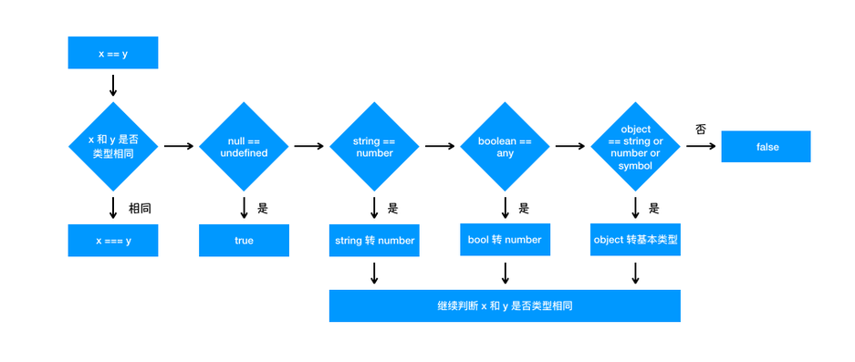

**What are the rules for type coercion of the == operator?**

For the == operator,if the types of the two operands being compared are different, the type conversion is performed. If you compare whether x and y are the same, the following judgment process will be performed:
1. First, it will determine whether the two types are the same, and compare the size of the two if they are the same;
2. If the types are not the same, type conversion will be performed;
3. It will first determine whether it is comparing null and undefined, and if it is, it will return true
4. Check if the types of both are string and number, if so, the string will be converted to number.
```JavaScript 
	1 == '1'
		  ↓
    1 ==  1
```
5. To determine whether one of the parties is a boolean, if so, it will change the boolean to number and then make a judgment
```JavaScript 
	'1' == true
    		↓
    '1' ==  1
    		↓
     1 == 	1
```
6. Determine if one of the elements is an object and the other is a string, number, or symbol. If so, the object will be converted to its primitive type before the comparison.
```JavaScript 
	'1' == { name: 'js' }
    		↓
    '1' ==  '[object object]'
```
**The flow chart is as follows:**
